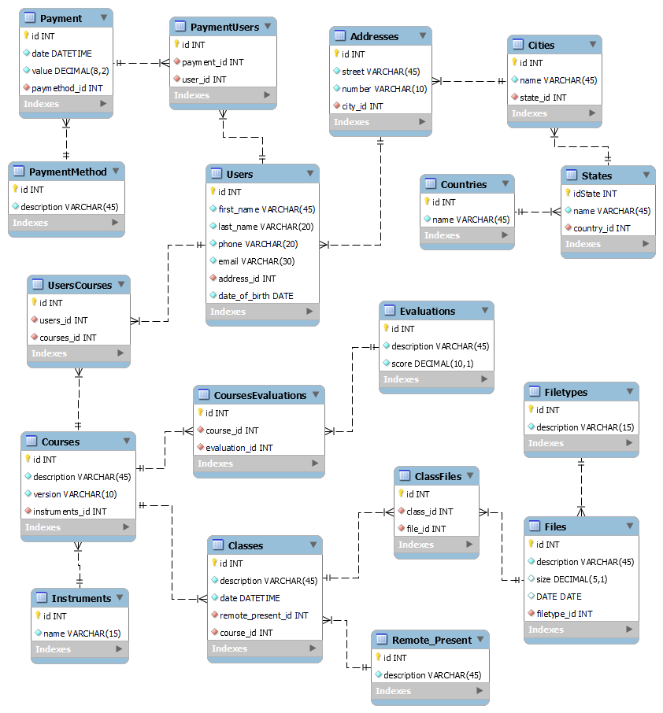

# Java-Automation-Course-Solvd

### DDL and DML

* Database for on-demand project - Teacher's platform to organize classes, files, evaluations and payments from their students.
Normalization standard: 1NF, 2NF and 3NF

* 